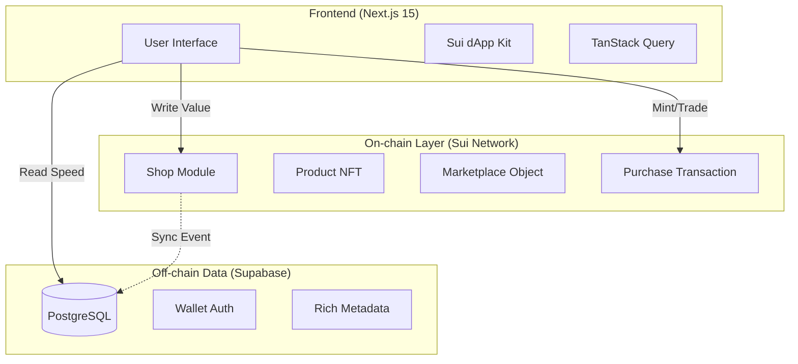

# 🛍️ Sui Shopping Cart - Decentralized Hybrid Marketplace

> **The Future of E-commerce on Sui Network**
>
> A hybrid marketplace architecture combining **On-chain Trust (Sui Move)** with **Off-chain Speed (Supabase)**.


## 📖 Introduction

**Sui Shopping Cart** is a decentralized e-commerce platform that solves the "slow UI" problem of pure dApps.

Users enjoy a Web2-like shopping experience (fast search, rich metadata, instant loading) while all assets (Products) and transactions (Payments) are settled securely on the **Sui Blockchain**.

### 🌟 Key Highlights

- **🛒 Hybrid Architecture**: "Fast as Web2, Trusted as Web3".
- **🏪 Shop Management**: Decentralized shop creation with on-chain ownership (`ShopOwnerCap`).
- **📦 NFT Products**: Every item is a unique NFT minted on Sui.
- **💸 Atomic Settlements**: Instant payment & stock deduction in a single transaction blocks.
- **📊 Admin Dashboard**: Governance tools for marketplace oversight.

---

## 🏗️ System Architecture

Our system uses a dual-layer approach to ensure both performance and security.



### 🧠 Smart Contracts (Move)

The core logic resides in `contracts/sources/`:

| Module | Description | Key Objects |
|--------|-------------|-------------|
| `shop.move` | Manages shop creation & ownership. | `Shop`, `ShopOwnerCap`, `Marketplace` |
| `product.move`| Defines product NFT standard & stock. | `Product`, `TransferPolicy` |
| `purchase.move`| Handles atomic buying operations. | `buy()` (Atomic Swap) |
| `receipt.move` | Proof of purchase generation. | `Receipt` |

### 🗄️ Database Schema (Supabase)

We use Supabase to store "heavy" data that is expensive to query on-chain (Search indices, history, audit logs).

```sql
-- Core Shop Table
CREATE TABLE shops (
    id uuid PRIMARY KEY,
    owner_wallet text NOT NULL UNIQUE,
    shop_name text NOT NULL,
    status text DEFAULT 'PENDING', -- PENDING, ACTIVE, SUSPENDED
    address_city text NOT NULL,
    ...
);
```

---

## ✨ Features Breakdown

### 🛒 For Buyers
- **Search & Discovery**: Instant product search (powered by Supabase).
- **Shopping Cart**: Local-storage based cart (persists across sessions).
- **Checkout**: Seamless wallet transaction (Suiet, Ethos, etc.).
- **Receipts**: NFT receipts minted upon successful purchase.

### 🏪 For Sellers
- **Onboarding**: Create a Shop (mints `ShopOwnerCap`).
- **Inventory**: Mint Products as NFTs.
- **Management**: Update prices, stock, and descriptions.
- **Analytics**: View sales history (coming soon).

### 🛡️ For Admins
- **Verification**: Approve/Reject new shops.
- **Governance**: Suspend bad actors.
- **Audit Logs**: Full history of shop status changes.

---

## 🚀 Installation & Setup

### Prerequisites
- [Node.js](https://nodejs.org/) v18+
- [Sui CLI](https://docs.sui.io/guides/developer/getting-started/sui-install)
- [Supabase](https://supabase.com/) Project

### 1️⃣ Clone Project

```bash
git clone https://github.com/qminh77/SUI_Shopping_Cart.git
cd SUI_Shopping_Cart
```

### 2️⃣ Smart Contracts

Deploy the Move contracts to Sui Testnet.

```bash
cd contracts

# Build sources
sui move build

# Publish (Make sure you have SUI for gas)
sui client publish --gas-budget 100000000
```

> ⚠️ **IMPORTANT**: After publishing, look for the **Package ID** and **Shared Object IDs** in the output console. You will need these for the frontend.

### 3️⃣ Frontend Configuration

1. Go to `web` directory:
   ```bash
   cd ../web
   ```

2. Duplicate `.env.local.example` to `.env.local`:
   ```bash
   cp .env.local.example .env.local
   ```

3. Update `.env.local` with your values:

```properties
# --- SUI NETWORK ---
# From your deployment output
NEXT_PUBLIC_PACKAGE_ID=0x...
NEXT_PUBLIC_MARKETPLACE_ID=0x...      # The 'Marketplace' Shared Object
NEXT_PUBLIC_TRANSFER_POLICY_ID=0x...  # The 'TransferPolicy<Product>' Shared Object

# --- SUPABASE ---
# From Supabase Dashboard -> Settings -> API
NEXT_PUBLIC_SUPABASE_URL=https://your-project.supabase.co
NEXT_PUBLIC_SUPABASE_ANON_KEY=your-public-anon-key
SUPABASE_SERVICE_ROLE_KEY=your-secret-service-role-key
```

### 4️⃣ Database Migration

Go to your Supabase SQL Editor and run the migration script located at:
`web/supabase/migrations/001_shops_schema.sql`

Only `shops` and `shop_audit_logs` tables are required for the MVP.

### 5️⃣ Run Application

```bash
# Install dependencies
npm install

# Start dev server
npm run dev
```

Visit `http://localhost:3000` 🚀

---

## 📖 User Guide

### How to Buy?
1. Connect Wallet (Top right corner).
2. Browse products on the Homepage.
3. Click "Add to Cart".
4. Open Cart (Right drawer) > Click "Checkout".
5. Approve the transaction in your Wallet.
6. 🎉 Done! You receive the Item + Receipt.

### How to Sell?
1. Go to `/seller`.
2. Click "Create Shop" (Requires small gas fee).
3. Wait for Admin Approval (or auto-approve in dev mode).
4. Once Active: Click "Add Product" to mint NFTs.

---

## 🛠️ Troubleshooting

**Issue: "Invalid API Key"**
- Make sure you are using the `service_role` key for `SUPABASE_SERVICE_ROLE_KEY`. It starts with `ey...` but is different from the `anon` key.

**Issue: 500 Error on `/api/shops/me`**
- Check your `.env.local`.
- Ensure your Wallet Address handling is consistent (lowercase vs checksum).

**Issue: Transaction Failed (MoveAbort)**
- `EStockInsufficient (0)`: The product is out of stock.
- `EPaymentInsufficient (1)`: You didn't send enough SUI.

---

## 🤝 Contributing

Contributions are welcome! Please check the [Issues](https://github.com/qminh77/SUI_Shopping_Cart/issues) tab.

1. Fork it.
2. Create your feature branch (`git checkout -b feature/cool-feature`).
3. Commit your changes.
4. Push to the branch.
5. Create a new Pull Request.

---

## 📄 License

This project is licensed under the MIT License - see the [LICENSE](LICENSE) file for details.

<p align="center">Made with ❤️ for the Sui Community</p>
